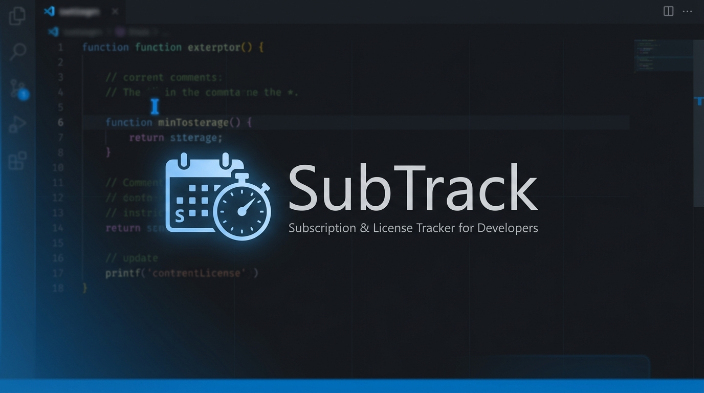
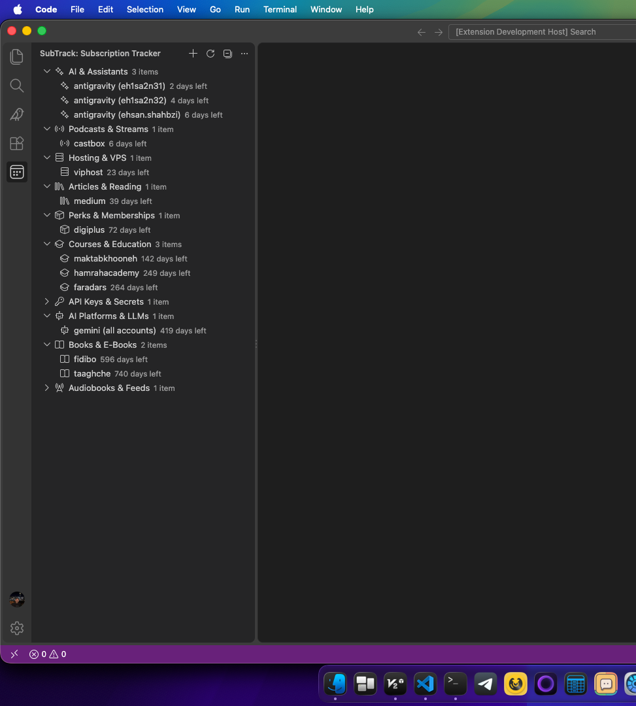
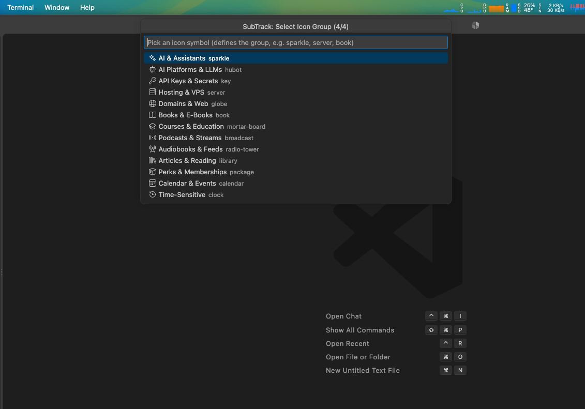
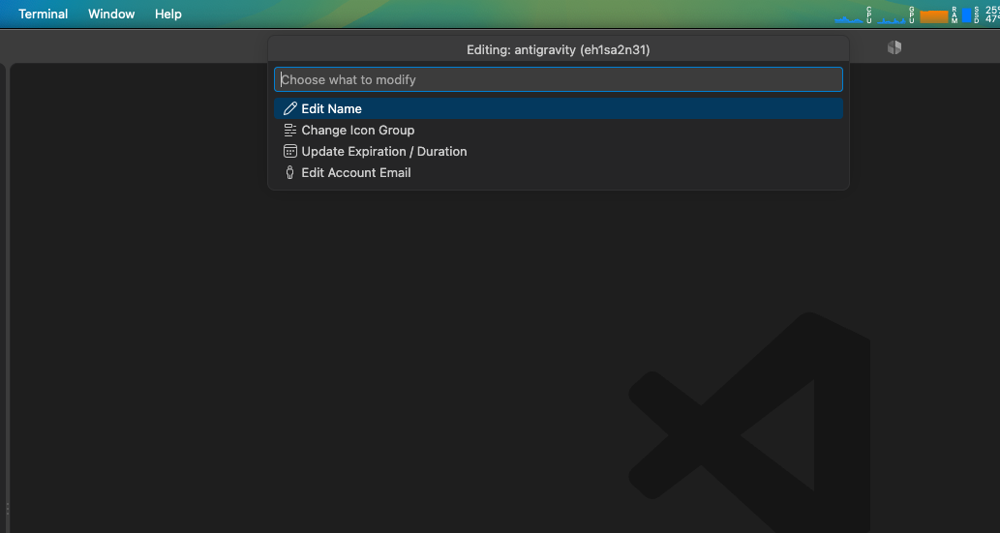

<p align="center">
  
</p>

<p align="center">
  <a href="https://marketplace.visualstudio.com/items?itemName=ehsanshahbazi.subtrack-subscriptions"></a>
  <a href="https://marketplace.visualstudio.com/items?itemName=ehsanshahbazi.subtrack-subscriptions"></a>
  <a href="https://github.com/EhsanShahbazii/SubTrack-Subscriptions/blob/main/LICENSE"></a>
  <a href="https://github.com/EhsanShahbazii/SubTrack-Subscriptions"></a>
</p>

<p align="center">
  <b>SubTrack</b> is a minimal, native Visual Studio Code extension designed for developers to track recurring subscriptions, software licenses, domain renewals, hosting plans, and AI token quotas without leaving the editor.
</p>

---

## ⚡ Highlights

- 📂 **Auto-Categorized Collapsible Groups**: Automatically groups subscriptions under meaningful categories (**AI & Assistants**, **Hosting & VPS**, **Courses & Education**, **Books & E-Books**, etc.) powered by native VS Code Codicons.
- ⏳ **Dynamic Countdown Formatting**:
  - `> 48 hours`: Formatted cleanly as `X days left`
  - `≤ 48 hours`: Precise countdown formatted as `Xh left`
  - `Expired`: Clearly marked as `Expired Xd ago`
- 🔝 **Smart Automatic Sorting**: The most urgent renewals always float to the top of their groups, and urgent groups float to the top of the view.
- 🎨 **100% Native VS Code UI**: Built directly on `vscode.TreeDataProvider`. Zero webview overhead, instant startup, and seamless adaptation to your active VS Code theme.
- 🔒 **Privacy First**: Zero telemetry and zero third-party servers. All subscription data is persisted safely in your local VS Code `globalState`.
- 🛠️ **Full CRUD In-Editor**: Add, edit names, modify durations, change categories, and delete with safety confirmation prompts.

---

## 📸 Previews

### 1. Subscription Tracker Sidebar View
Collapsible meaningful categories, live countdowns, and quick inline management:
<p align="center">
  
</p>

### 2. Category & Codicon Selection
Intuitive 4-step wizard with built-in categorized icons:
<p align="center">
  
</p>

### 3. In-Editor Interactive Editing
Modify name, update expiration dates, or move subscriptions between categories seamlessly:
<p align="center">
  
</p>

---

## 🚀 Quick Start

### 1. Open SubTrack
Click the **Calendar icon** in your VS Code Activity Bar (left sidebar) to open the **SubTrack: Subscription Tracker** view.

### 2. Add a Subscription
Click the **`+` (Add Subscription)** icon in the view title bar:
1. **Service Name**: Enter the service name (e.g. `GitHub Copilot`, `Vercel Pro`).
2. **Expiration Format**: Choose `Days left`, `Hours left`, or `Exact Date (YYYY-MM-DD)`.
3. **Value**: Enter the remaining time or target date.
4. **Category / Icon**: Select a category icon (e.g., `$(sparkle) AI & Assistants`, `$(server) Hosting & VPS`, `$(book) Books & E-Books`).
5. **Account Note** *(Optional)*: Enter an account email or identifier.

### 3. Manage & Edit
- **Hover on an item**: View remaining duration, exact expiration timestamp, and linked account in a native Markdown tooltip.
- **Click the inline Edit icon `$(edit)`**: Rename, update remaining time, or move to another category.
- **Click the inline Trash icon `$(trash)`**: Safely delete a subscription with a confirmation prompt.
- **Load Sample Subscriptions**: Click `$(cloud-download)` in the view title to test features with generic developer presets.

---

## 🏷️ Supported Categories & Codicons

| Category Name | Codicon Symbol | Ideal For |
| :--- | :--- | :--- |
| **AI & Assistants** | `$(sparkle)` | GitHub Copilot, Cursor, Antigravity, Perplexity |
| **AI Platforms & LLMs** | `$(hubot)` | ChatGPT Plus, Claude Team, Gemini Advanced |
| **API Keys & Secrets** | `$(key)` | OpenAI API, Anthropic API, Groq, Cohere |
| **Hosting & VPS** | `$(server)` | AWS, DigitalOcean, Hetzner, Vercel, Railway |
| **Domains & Web** | `$(globe)` | Cloudflare, Namecheap, GoDaddy |
| **Documentation & Books** | `$(book)` | O'Reilly Learning, Kindle, E-books |
| **Courses & Learning** | `$(mortar-board)` | Coursera, Udemy, Frontend Masters |
| **Audio & Media Feeds** | `$(broadcast)` | Podcasts, Spotify, YouTube Premium |
| **Articles & Research** | `$(library)` | Medium, Substack, IEEE, ACM |
| **Tools & Dependencies** | `$(package)` | NPM Org, Docker Hub, Figma Organization |
| **Software Licenses** | `$(credit-card)` | JetBrains Toolbox, Windows/macOS utilities |
| **Time-Sensitive** | `$(clock)` | Trial periods, grace periods, temp tokens |
| **Calendar & Events** | `$(calendar)` | Annual renewals, certifications, hackathons |

---

## ⌨️ Commands

Access these commands from the Command Palette (<kbd>Ctrl</kbd>+<kbd>Shift</kbd>+<kbd>P</kbd> / <kbd>Cmd</kbd>+<kbd>Shift</kbd>+<kbd>P</kbd>):

| Command | Identifier | Description |
| :--- | :--- | :--- |
| **SubTrack: Add Subscription** | `subtrack.addSubscription` | Start the sequential creation wizard |
| **SubTrack: Refresh List** | `subtrack.refresh` | Recalculate remaining times and re-sort |
| **SubTrack: Edit Subscription** | `subtrack.editSubscription` | Modify name, duration, icon, or account note |
| **SubTrack: Delete Subscription** | `subtrack.deleteSubscription` | Remove a subscription with confirmation |
| **SubTrack: Load Sample Subscriptions** | `subtrack.seedSampleData` | Load starter templates for testing |
| **SubTrack: Clear All Subscriptions** | `subtrack.clearAll` | Reset local storage |

---

## 🛠️ Development & Building

To run and build this extension locally:

```bash
# Clone repository
git clone https://github.com/EhsanShahbazii/SubTrack-Subscriptions.git
cd SubTrack-Subscriptions

# Install dependencies
npm install

# Run automated tests
npm test

# Build extension
npm run build

# Package for VS Code Marketplace
npx @vscode/vsce package
```

Press <kbd>F5</kbd> in VS Code to launch the **Extension Development Host**.

---

## 📄 License

Distributed under the **MIT License**. See [`LICENSE`](LICENSE) for more details.

---

<p align="center">
  Crafted with ❤️ by <a href="https://github.com/EhsanShahbazii"><b>Ehsan Shahbazi</b></a>
</p>
